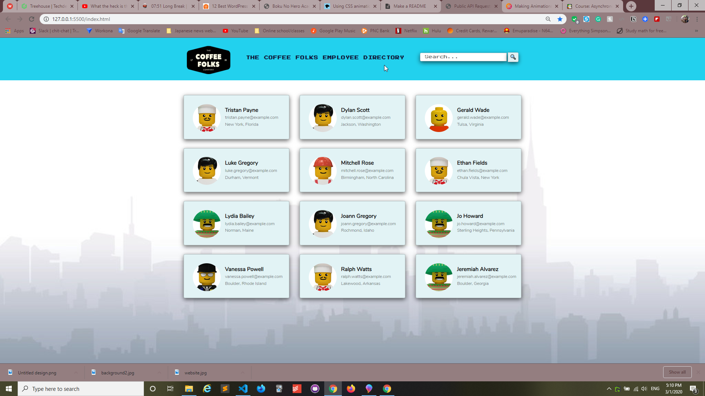
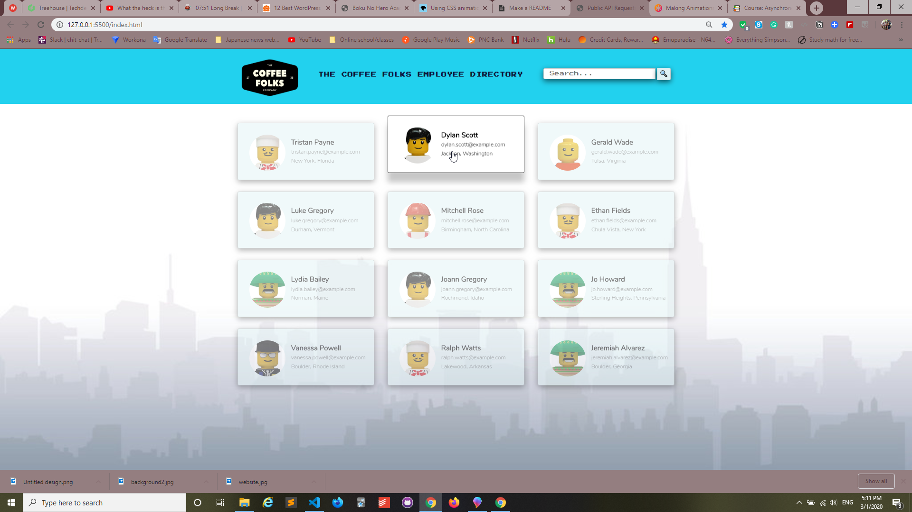
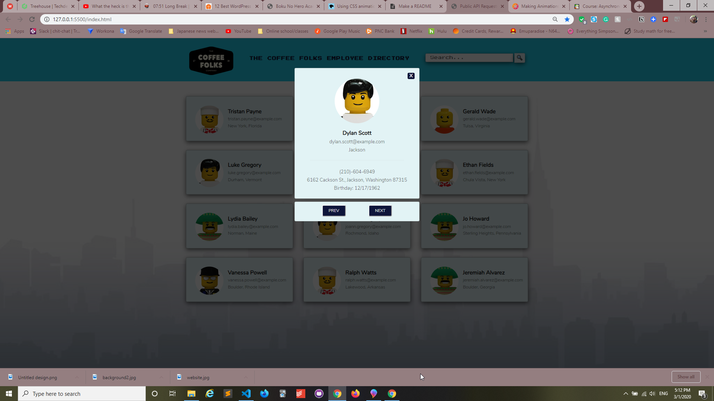
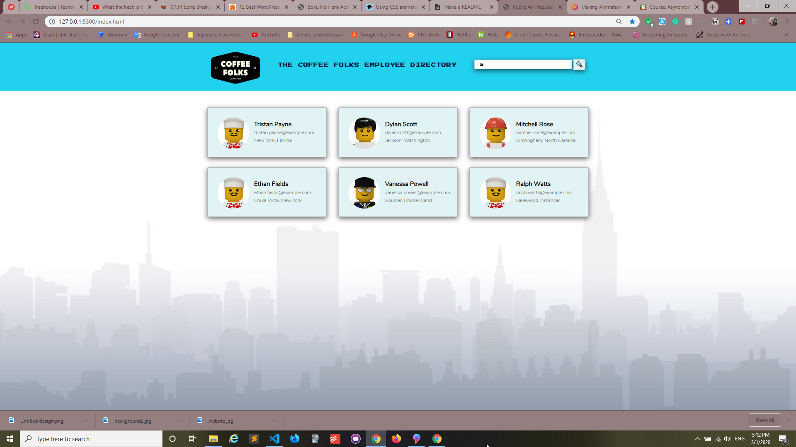

# Public-API-Project

---

Communicating with APIs allows you to work with microservices and with vast databases to build useful tools and relevant information quickly and easily. You can build utilities, games, infographics, and more. You can also integrate, display, and analyze social media and large data sets without having to create and curate them yourself.

This project utilizes the Randomuser API found here to pull random user data to make a mock employee directory

## Motivation

---

The motivation of this project is to showcase the use of modern asynchronous programming practices when communicating with an API. This project uses the Fetch API and Async/Await to request information from the Randomuser API(https://randomuser.me/), then parse that data to be displayed on the web application.

The keywords async and await, together, provide a special syntax that makes working with promise-based code easier and more intuitive –– you write asynchronous code that looks more like synchronous code.

The benefits of using Modern practices to write Asynchronous code are:

- Reduction in using callbacks which can create a "pyramid of doom" A.K.A "Callback Hell"
- Promise-based requests
- Async/Await code is more intuitive, requires less code, and is easier to read

## Technology Used

---

This project uses the following technologies:

- HTML
- CSS
- Vanilla JS
- Fetch API
- Async/Await
- RandomUser API

## Features

---

This project has several interesting features to make the code clean, more DRY, and more user friendly which are:

1. Modern Async/Await syntax which is syntactically similar to synchronous programming and is more intuitive and easier to read
2. No use of callbacks or traditional promises
3. Several reusable functions implemented to make code more DRY and readable
4. Search feature allowing user to filter out specific names they are looking for
5. Modals that reveal more information about the user
6. next and previous buttons that allow the user to go through modals of all users
7. CSS animations to enhance user interaction

## Usage

To make a request the randomuser API, you need to use some type of asynchronous code like AJAX, traditional promises, Fetch APi, async/await or a combination of those to send a request for data.

First, you need to specify the URL of the website, and then the parameters of what information you would like from the API

1. First add the URL : https://randomuser.me/api/
2. Use a query string to specify the data you want : ?results=12&nat=us&exc=login,gender,registered,id&lego

- This query string asks for 12 results, users must have US nationality, user picture will be lego people and to exclude login, gender, if registered, and their ID.

Example of the URL requesting information from API

```
  const randomUsersUrl =
    "https://randomuser.me/api/?results=12&nat=us&exc=login,gender,registered,id&lego";

```

This code example below uses async/await and Fetch API to send request to API, the browser will work asynchronously to grab the information while letting the user still interact with the page. Once that information has been given, the information will be parsed so it can be used on the page.

Lastly, traditional promises are used to execute these functions in order. Without the API information, these functions will fire and create errors because they are missing vital information.

```
getJSON: async url => {
      try {
        const response = await fetch(url);
        return await response.json();
      } catch (error) {
        const div2 = document.createElement("div");
        div2.className = "badServer";
        div2.innerHTML = `<h3>Looks like the server went and picked a bundle of WHOOPSIE DAISIES!</h3>
        <p> Please refresh the page and try and again</p>
        <p>${error}</p>`;
        gallery.appendChild(div2);
        throw error;
      }
    }

        mainFunctions
      .getJSON(randomUsersUrl)
      .then(mainFunctions.getRandomUsers)
      .then(mainFunctions.searchFunction)
      .then(mainFunctions.cardClickEvent);

```

---

## Code Example

---

This examples highlights the readability of async/await style of asynchronous programming. It is very similar to synchronous style of code syntactically

```
getJSON: async url => {
      try {
        const response = await fetch(url);
        return await response.json();
      } catch (error) {
        const div2 = document.createElement("div");
        div2.className = "badServer";
        div2.innerHTML = `<h3>Looks like the server went and picked a bundle of WHOOPSIE DAISIES!</h3>
        <p> Please refresh the page and try and again</p>
        <p>${error}</p>`;
        gallery.appendChild(div2);
        throw error;
      }
    }
```

This example is of a reusable function that determines if next or previous button is pressed then changes modal to the next one

```
  modalIncrements: (modalArray, modal, button, num) => {
    let currentModal = modalArray.indexOf(modal);
    modalArray[currentModal].style.display = "none";
    if (button === "prev") {
      currentModal -= 1;
    }
    if (currentModal >= 0 && currentModal < modalArray.length - 1) {
      if (button === "next") {
        currentModal += 1;
      }
      modalArray[currentModal].classList = "modal-container";
      modalArray[currentModal].style.display = "";
    } else {
      if (button === "next") {
        currentModal = num;
      } else {
        currentModal = num - 1;
      }
      modalArray[currentModal].classList = "modal-container";
      modalArray[currentModal].style.display = "";
    }
  }

```

## Screenshots

---






## Style Changes

---

The following style changes to the original Treehouse project are as noted:

1. Background image added
2. Font style and sizes altered
3. CSS fade in/fade out animations added
4. Fake company logo added
5. Color scheme changed

## License

---

MIT © Jamie Gobeille 2020
